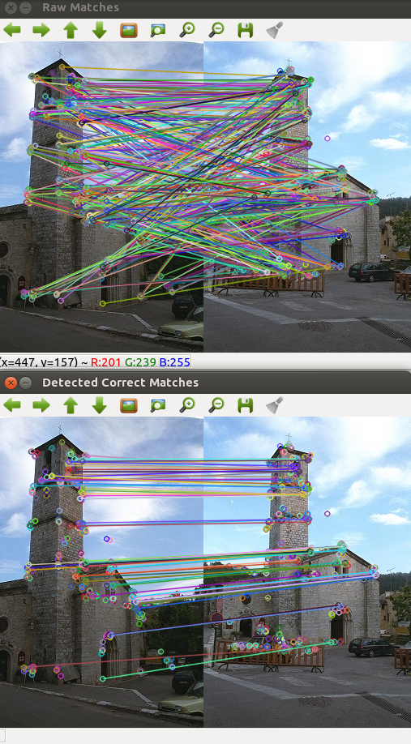

# Robust Keypoint Matching with ORB Features

Basic demo of the papers

    [1] Jiayi Ma, Ji Zhao, Jinwen Tian, Alan Yuille, and Zhuowen Tu.<br/>
        Robust Point Matching via Vector Field Consensus,<br/>
        IEEE Transactions on Image Processing, 23(4), pp. 1706-1721, 2014<br/>
        
    [2] Jiayi Ma, Ji Zhao, Jinwen Tian, Xiang Bai, and Zhuowen Tu.<br/>
        Regularized Vector Field Learning with Sparse Approximation for Mismatch Removal,<br/>
        Pattern Recognition, 46(12), pp. 3519-3532, 2013<br/>


The original code supplied by this paper uses the SURF detectors which a lot of people have issues compiling due to the copyright issues with the SURF implementation. I adopted their original code to make it working with ORB features. 


# How to Compile
Only dependency is OpenCV
```
mkdir build
cmake ..
make
./robust_matcher
```

# Result


